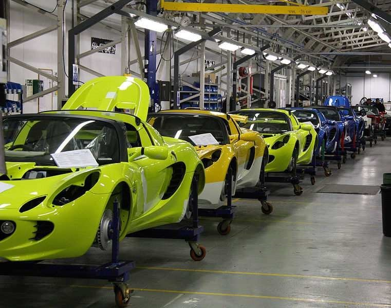
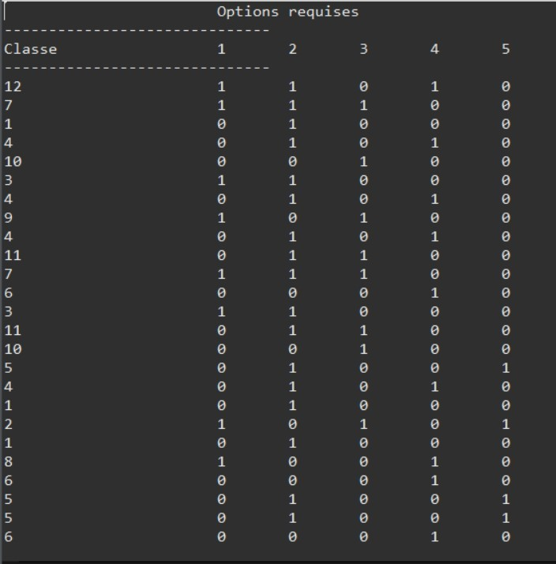

# Car-Sequencing problem solved with Constraint Programming :

- Problem Description :

Cars in a production line can be configured with various options. A given option set forms a class of cars, so for each class there is a certain demand for a car.

The problem comes down to the fact that we have a capacity constraint at the level of the production line: the maximum number of cars (q) with option (i) that can be produced on a sub-sequence of size (p).

Our main goal is to arrange the sequence of all requested cars so that none of the capacity constraints are violated.
See "Car Sequencing" pdf for more detaills.

- Constraints :
1) for an 'option', at most 'p' are allowed in a subsequence of length 'q'.
2) The number of cars in each class in terms of demand must be equal to the number of cars allowed for each class. This constraint will ensure that each car in a position has a class according to the requestPerClass values (an array that represents cars by class).
3) The options of a given car must conform to the class to which it belongs.

- The Solution for the given problem :

